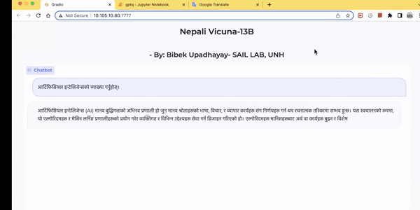

# Nepali-Chat-GPT 🇳🇵

This repository consists of the demo for the first open-source Nepali Alpaca ChatGPT LLM.

To the best of our knowledge, this is the first open-source large language model created specifically for the Nepali language.

We have released both the LoRA files and the merged files on HuggingFace.


## Models and LoRA Adapter Weights:
1. **🇳🇵Nepali Alpaca Chat-GPT-7B**: We have finetuned the timdettmers/guanaco-7b model with the Nepali-Alpaca-GPT4 dataset. 
HuggingFace Link: https://huggingface.co/saillab/Nepali_Alpaca_ChatGPT_7B

2. **🇳🇵Nepali Alpaca Chat-GPT-13B**: We finetuned the TheBloke/stable-vicuna-13B-GPTQ model with the Nepali-Alapaca-GPT4 dataset.
HuggingFace Link: https://huggingface.co/saillab/Nepali_Alpaca_ChatGPT_13B

3. **🇳🇵Nepali Alpaca Caht-GPT-33B**: For this model we finetuned the timdettmers/guanaco-33b-merged with Nepali-Alpaca-GPT4 datset. 
HuggingFace Link: https://huggingface.co/saillab/Nepali_Alpaca_ChatGPT_33B 

## Output:

**🇳🇵7B Model Generated Output**
```
### Instruction:आर्टिफिशियल इन्टेलिजेन्सको व्याख्या गर्नुहोस्। 
### Output: आर्टिफिसियल इन्टेलिजेन्स, प्रायः एआई भनेर चिनिन्छ, कम्प्युटर प्रणालीहरूको विकास हो जसले सामान्यतया मानव बुद्धिको आवश्यकता पर्ने कार्यहरू गर्न सक्छ। यसले कम्प्युटरहरूलाई स्पष्ट रूपमा प्रोग्राम नगरी सिक्न र सिक्न सक्ने क्षमता प्रदान गर्दछ, जसले तिनीहरूलाई स्वचालित रूपमा समस्याहरू समाधान गर्न र निर्णय गर्न सक्षम बनाउँछ। यसले कम्प्युटर प्रणालीहरूलाई मानिसले जस्तै सोच्न र निर्णय गर्न सक्षम बनाउँछ। यसले स्वास्थ्य सेवा उद्योगमा क्रान्तिकारी परिवर्तन गर्ने क्षमता प्रदान गर्दछ 


### Instruction: विश्वका दुर्लभ भाषाहरूको संरक्षणको महत्त्व तीन वाक्यमा व्याख्या गर्नुहोस्।
### Output: विश्वका दुर्लभ भाषाहरूको संरक्षण धेरै कारणहरूको लागि महत्त्वपूर्ण छ। पहिलो, यसले संस्कृतिको विविधतालाई बढावा दिन्छ र विश्वभरका मानिसहरूलाई विभिन्न भाषाहरू सिक्न अनुमति दिन्छ। दोस्रो, संरक्षित भाषाहरूको संरक्षणले विगतका भाषाहरूलाई जोगाउँछ जुन अझै पनि प्रायः प्रयोग हुन्छन्। तेस्रो, संरक्षित भाषाहरूको संरक्षणले विभिन्न संस्कृतिका सांस्कृतिक सामग्रीहरूको संरक्षण र संरक्षण गर्दछ, जसले संस्कृतिको विविधतालाई बढावा दिन्छ।  
```

**🇳🇵13B Model Generated Output**
```
### Instruction: कृपया मेसिन लर्निङको व्याख्या गर्नुहोस्।

### Output: मेसिन लर्निङ भनेको डाटाबाट सिक्ने कम्प्युटर-आधारित अनुप्रयोगहरू जस्तै मेसिन लर्निङ संरचनाहरू द्वारा प्रशिक्षण गरिएको डेटा प्रयोग गरी सञ्चालन गर्ने विशेष प्रकारको कम्प्युटर प्रणाली हो। यस प्रकारको कम्प्युटर प्रणालीले स्थानान्तरण र प्रशिक्षण गर्न डेटा प्रयोग गर्छ, र यसको कार्यसम्पादनलाई अनुमानित रूपमा सुधार गर्न सक्छ। मेसिन लर्निङ प्रणालीहरूले उनीहरूको लिङ्क र अनुप्रयोगहरू सिक्ने र प्रशिक्षण गर्ने डेटामा सुधार गर्न सक्छन्, सामान्यतया व्यक्तिगत प्रविधिहरू जस्तै चिकनहरू पहिचान गर्ने र इन्स्ट्रुक्टरहरू व्यवहार गर्ने समावेश गर्दछ। मेसिन लर्निङ प्रणालीहरू विभिन्न उद्योगहरूमा फाइदा पुर्‍याउन सक्छन्, जस्तै स्वास्थ्य सेवा, उद्योग, र वित्त, र यसलाई धेरै प्रयोगकर्ता अनुभवहरू र स्रोतहरू प्रयोग गरेर विकास गरिएको छ।


```


**🇳🇵33B Model Generated Output**
```
### Instruction: आर्टिफिसियल इन्टेलिजेन्स भनेको के हो
### Output: आर्टिफिसियल इन्टेलिजेन्स, सामान्यतया एआई भनेर चिनिन्छ, कम्प्युटर विज्ञानको एउटा शाखा हो जसले मानिसले जस्तै सोच्न र काम गर्न सक्ने कम्प्युटर प्रणालीहरू विकास गर्ने प्रक्रियालाई बुझाउँछ। यसमा मेसिन लर्निङ, न्यूरल नेटवर्कहरू, र प्राकृतिक भाषा प्रशोधन जस्ता विभिन्न प्रविधिहरू समावेश हुन्छन् जसले कम्प्युटरहरूलाई स्पष्ट रूपमा प्रोग्राम नगरी सिक्न र समस्याहरू समाधान गर्न सक्षम बनाउन मद्दत गर्दछ। 


### Instruction: वातावरण कसरी जोगाउने ? 
### Output: त्यहाँ धेरै तरिकाहरू छन् जुन हामी वातावरण जोगाउन सक्छौं। यहाँ केही सुझावहरू छन् 1. घटाउनुहोस्, पुन: प्रयोग गर्नुहोस्, र पुन: प्रयोग गर्नुहोस् घटाउनुहोस्, पुन: प्रयोग गर्नुहोस्, र पुन: प्रयोग गर्नुहोस् भनेको फोहोर उत्पादन घटाउने, पुन: प्रयोग गर्ने, र पुन: प्रयोग गर्ने सबैभन्दा प्रभावकारी तरिकाहरू मध्ये एक हो। यसले घटाउने, पुन: प्रयोग गर्ने र पुन: प्रयोग गर्नेलाई प्रोत्साहन दिन्छ र वातावरणमा नकारात्मक प्रभावहरू कम गर्न मद्दत गर्दछ। २. ऊर्जा खपत घटाउनुहोस्: ऊर्जा खपत घटाउनु भनेको ऊर्जा-कुशल उपकरणहरू प्रयोग गर्नु, प्रयोगमा नभएको बेला बत्तीहरू र इलेक्ट्रोनिक्सहरू बन्द गर्नु, र प्रयोगमा नभएको इलेक्ट्रोनिक्स र उपकरणहरू पुन: प्रयोग गर्ने जस्ता कदमहरू चाल्नु हो। यसले ऊर्जा खपत घटाउने र वातावरणमा नकारात्मक प्रभावहरू घटाउने एक प्रभावकारी तरिका हो। 3. एकल-प्रयोग प्लास्टिक घटाउनुहोस्: एकल-प्रयोग प्लास्टिक घटाउनु भनेको एकल-प्रयोग प्लास्टिक सामग्रीहरू प्रयोग गर्नु अघि उनीहरूलाई पुन: प्रयोग गर्ने 
```


### How to contribute?

We highly encourage you to contribute to this open-source project. Please feel free to fill this Google Form: https://forms.gle/CRN1KJsjNpNsfSR66 
